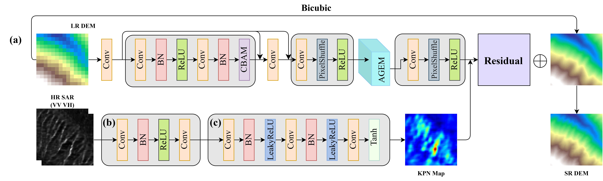
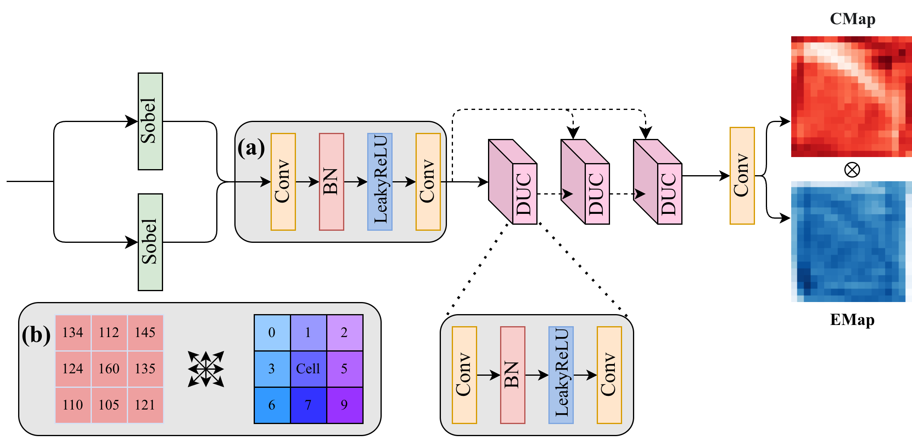

# TGFSR: Terrain-Guided Fusion Network for DEM Super-Resolution

Official-style PyTorch implementation of **TGFSR**, a terrain-guided multi-modal fusion network for digital elevation model (DEM) super-resolution. TGFSR progressively reconstructs high-resolution terrain from low-resolution DEM input and high-resolution SAR observations.



## Highlights

- **Terrain-guided evolution.** AGEM uses DEM-derived terrain attributes to guide iterative feature refinement.
- **SAR-DEM fusion.** High-resolution SAR VV/VH channels provide complementary structural cues for DEM reconstruction.
- **Progressive reconstruction.** The model upsamples from LR to MR and then HR, reducing the difficulty of direct large-scale reconstruction.
- **Topology-aware supervision.** Training combines content loss with slope consistency to preserve geomorphological fidelity.

## Method Overview

TGFSR contains three main stages:

1. **LR feature extraction:** residual CBAM blocks extract low-resolution DEM representations.
2. **MR terrain refinement:** AGEM blocks use slope/aspect-aware iterative evolution to enhance terrain structures.
3. **HR SAR-DEM fusion:** SAR features dynamically modulate DEM features before residual prediction.



## Repository Structure

```text
TGFSR/
|-- TGFSR_AGEM_model.py    # Network architecture and fusion modules
|-- train.py               # Training and validation pipeline
|-- test.py                # GeoTIFF evaluation and metric calculation
|-- dem_features.py        # Slope operator used by the training loss
|-- loss.py                # PSD loss implementation
|-- visualization.py       # Training visualization utility
|-- images/                # Architecture figures
|-- best_rmse_model.pth    # Example checkpoint
`-- README.md
```

## Environment

| Package | Version |
|---------|---------|
| Python | 3.10.19 |
| PyTorch | 2.1.2+cu121 |
| TorchVision | 0.16.2+cu121 |
| NumPy | 1.26.4 |
| GDAL | 3.10.2 |
| scikit-image | 0.22.0 |
| Matplotlib | 3.8.4 |
| tqdm | 4.67.1 |

Recommended minimal installation:

```bash
conda create -n geoenv python=3.10
conda activate geoenv
pip install torch torchvision torchaudio
pip install numpy gdal scikit-image matplotlib tqdm
```

## Dataset

Training and testing data can be obtained from [Figshare](https://doi.org/10.6084/m9.figshare.31868503).

Organize the dataset as follows. Corresponding LR, HR, SAR_VV, and SAR_VH files should share the same filename.

```text
path/to/your/dataset/
|-- train/
|   |-- HR/         # High-resolution DEMs (*.tif)
|   |-- LR/         # Low-resolution DEMs (*.tif)
|   |-- SAR_VV/     # SAR VV-polarization images (*.tif)
|   `-- SAR_VH/     # SAR VH-polarization images (*.tif)
|-- val/
|   |-- HR/
|   |-- LR/
|   |-- SAR_VV/
|   `-- SAR_VH/
`-- test/
    |-- HR/
    |-- LR/
    |-- SAR_VV/
    `-- SAR_VH/
```

## Training

```bash
python train.py \
    --dataroot path/to/your/dataset/train \
    --val_dataroot path/to/your/dataset/val \
    --out path/to/your/results/train \
    --nEpochs 100 \
    --batchSize 16 \
    --lr 5e-5 \
    --upSampling 4 \
    --n_res_blocks 1 \
    --n_agem_blocks 1 \
    --agem_iterations 3 \
    --slopeWeight 0.2 \
    --augment false
```

Important arguments:

- `--dataroot`: training dataset root.
- `--val_dataroot`: validation dataset root.
- `--out`: directory for checkpoints, logs, and visualizations.
- `--n_res_blocks`: number of residual CBAM blocks.
- `--n_agem_blocks`: number of AGEM blocks.
- `--agem_iterations`: number of internal iterations per AGEM block.
- `--slopeWeight`: weight of the slope consistency loss.
- `--psdWeight`: weight of the PSD loss. The default is `0`.
- `--auto_resume`: resume from `latest_model.pth` in the output directory.

## Evaluation

```bash
python test.py \
    --model_path path/to/your/results/train/best_rmse_model.pth \
    --test_dir path/to/your/dataset/test \
    --output_dir path/to/your/results/test \
    --upsample_factor 4 \
    --n_res_blocks 1 \
    --n_agem_blocks 1
```

The testing script reports RMSE, MAE, PSNR, and SSIM, and saves reconstructed GeoTIFF files to:

```text
path/to/your/results/test/SR_images_tif/
```

## Checkpoints

During training, the following files are generated under `path/to/your/results/train`:

- `best_rmse_model.pth`: model with the best validation RMSE.
- `latest_model.pth`: latest full training checkpoint.
- `generator_XXX.pth`: interval checkpoints controlled by `--save_interval`.
- `log_metrics.txt` and `log_losses.txt`: training and validation logs.
- `visualizations/`: qualitative LR/Bicubic/SR/HR comparisons.

